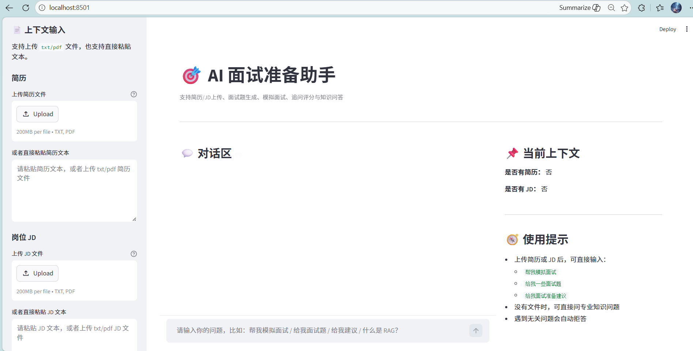
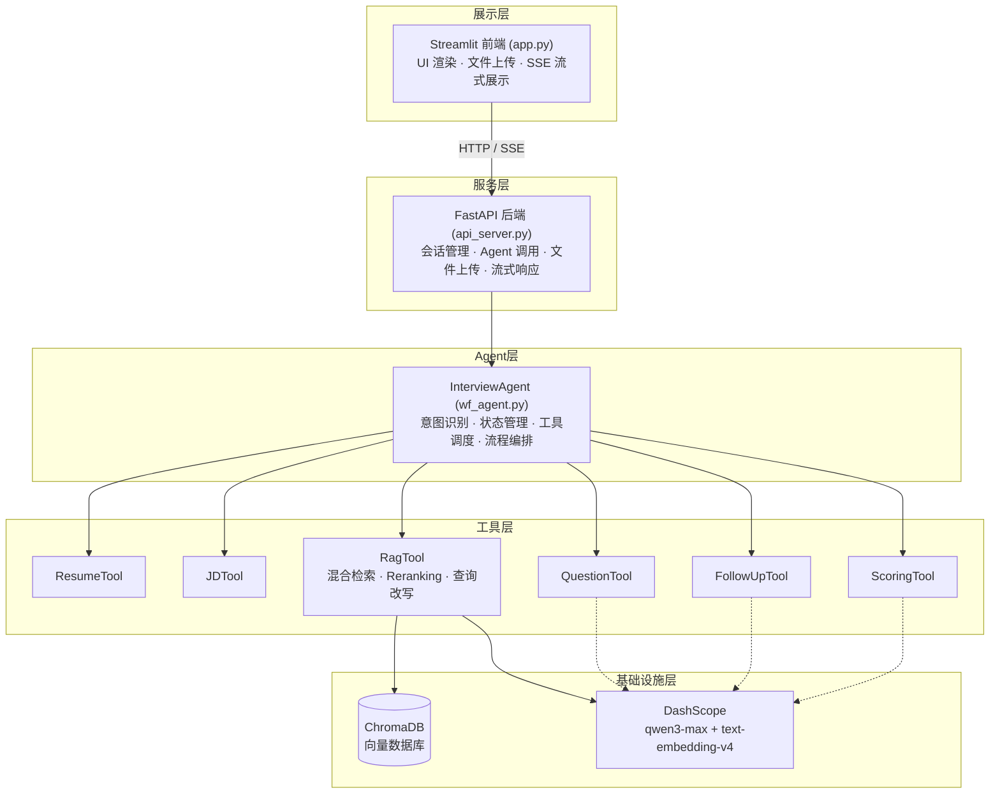
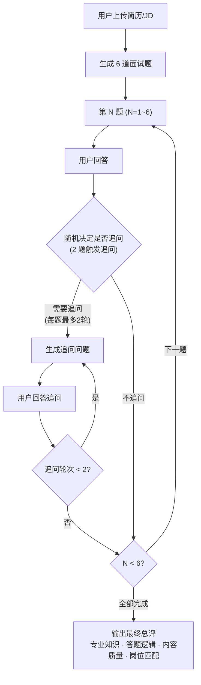

# AI 面试准备助手

基于大模型 RAG + Agent 的智能面试准备系统，支持简历/JD 解析、面试题生成、模拟面试（含追问与评估）与专业知识问答。

## 核心功能

| 功能 | 说明 |
|------|------|
| 简历/JD 解析 | 上传简历和岗位 JD（txt/pdf），自动结构化抽取关键信息 |
| 面试题生成 | 结合简历、JD 和知识库，生成带题型、考察点、参考答案的面试题 |
| 模拟面试 | 6 道题逐题推进，随机 2 题触发最多 2 轮追问，全部作答后输出最终总评 |
| 追问与评分 | 追问基于用户回答动态生成（每题最多 2 轮），全部作答后统一输出四维度总评 |
| 知识问答 | 基于 RAG 检索回答面试专业知识，知识库未命中时自动降级为通用兜底 |
| 意图识别 | LLM 语义分类 + 关键词兜底，自动区分出题/模拟面试/建议/问答/拒答 |

## 项目亮点

- **支持简历 / JD 自动解析**：上传 txt / pdf 后自动抽取关键信息，辅助生成更贴合岗位的面试内容
- **支持模拟面试与动态追问**：按题目逐步推进，结合用户回答生成追问，并支持多轮追问
- **混合检索 + Rerank 提升问答效果**：结合 BM25、向量检索与 rerank 精排，增强知识问答相关性
- **支持历史会话管理**：历史会话自动保存，可自由切换历史会话窗口，也可以手动开启新对话、删除历史会话
- **前后端分离，便于扩展**：Streamlit 前端 + FastAPI 后端，结构清晰，方便后续接入更多能力

## 项目演示

下图展示了项目的交互界面：



## 技术架构



## 技术栈

- **前端**：Streamlit
- **后端**：FastAPI + Uvicorn
- **Agent 框架**：LangChain（工作流编排 + LLM 意图分类）
- **LLM**：通义千问 qwen3-max (DashScope)
- **Embedding**：text-embedding-v4 (DashScope)
- **向量数据库**：ChromaDB
- **检索策略**：BM25 + 向量混合检索 + gte-rerank 精排 + 查询改写
- **会话存储**：SQLite
- **文档解析**：pypdf (PDF)
- **LLM 调用优化**：tenacity 重试 + 指数退避

## 项目结构

```
AI面试准备助手项目/
├── app.py                  # Streamlit 前端
├── api_server.py           # FastAPI 后端 API
├── start.py                # 一键启动脚本
├── requirements.txt        # 依赖清单
├── config/                 # 配置文件
│   ├── app.yml             # 应用全局配置（端口、临时文件等）
│   ├── agent.yml           # Agent 调度配置（工作流模式、最大步数等）
│   ├── rag.yml             # 模型与 RAG 基础配置
│   ├── chroma.yml          # 向量库与混合检索配置
│   ├── interview.yml       # 面试业务配置（评分维度、追问规则等）
│   └── prompts.yml         # Prompt 路径映射
├── prompts/                # Prompt 模板
│   ├── main_prompt.txt
│   ├── intent_classify_prompt.txt
│   ├── question_generation_prompt.txt
│   ├── mock_interview_prompt.txt
│   ├── answer_scoring_prompt.txt
│   ├── followup_prompt.txt
│   ├── rag_query_prompt.txt
│   ├── query_rewrite_prompt.txt
│   ├── reference_answer_prompt.txt
│   ├── final_evaluation_prompt.txt
│   ├── jd_parse_prompt.txt
│   └── resume_parse_prompt.txt
├── ai_interview_assistant/ # 核心代码
│   ├── agent/
│   │   ├── wf_agent.py     # 工作流编排 Agent（意图识别、状态管理、流程编排）
│   │   └── tools/          # Agent 工具集
│   │       ├── resume_tool.py    # 简历解析
│   │       ├── jd_tool.py        # JD 解析
│   │       ├── question_tool.py  # 面试题生成
│   │       ├── followup_tool.py  # 追问生成
│   │       ├── scoring_tool.py   # 答案评分
│   │       └── rag_tool.py       # RAG 检索问答
│   ├── rag/
│   │   ├── rag_service.py    # RAG 服务（检索+生成+降级策略）
│   │   ├── vector_store.py   # 向量库管理（构建、检索、混合搜索）
│   │   └── kb_builder.py     # 知识库构建
│   ├── model/
│   │   ├── factory.py        # 模型工厂（Chat + Embedding 单例）
│   │   └── output_parser.py  # 输出解析
│   ├── utils/
│   │   ├── config_handler.py # 配置加载
│   │   ├── prompt_loader.py  # Prompt 加载
│   │   ├── logger_handler.py # 日志
│   │   ├── json_utils.py     # JSON 解析工具
│   │   ├── text_utils.py     # 文本处理
│   │   ├── file_handler.py   # 文件处理
│   │   └── path_tool.py      # 路径工具
│   └── storage.py            # SQLite 会话持久化
├── data/                   # 知识库原始文档
│   ├── ai_agent_engineer.txt
│   ├── llm_engineer.txt
│   ├── RAG_engineer.txt
│   ├── ML_DL_NLP.txt
│   └── interview_preparation.txt
├── chroma_db/              # ChromaDB 向量库（自动生成）
├── tmp_uploads/            # 临时上传文件（自动生成，自动清理）
├── tests/                  # 测试
│   ├── test_core.py
│   └── test_rag_optimization.py
└── logs/                   # 运行日志（自动生成）
```

## 快速开始

### 环境要求

- Python >= 3.10
- DashScope API Key（通义千问）

### 安装依赖

```bash
pip install -r requirements.txt
```

### 配置

1. 在 `config/rag.yml` 中配置模型参数（默认使用 qwen3-max）
2. 确保 DashScope API Key 已设置环境变量 `DASHSCOPE_API_KEY`

### 启动

**方式一：一键启动（推荐）**

```bash
python start.py
```

自动启动 FastAPI 后端 + Streamlit 前端，按 `Ctrl+C` 同时关闭。

**方式二：分别启动**

```bash
# 终端 1：启动后端
uvicorn api_server:app --host 127.0.0.1 --port 8000

# 终端 2：启动前端
streamlit run app.py
```

启动后访问：
- 前端页面：http://localhost:8501
- 后端 API：http://127.0.0.1:8000
- API 文档：http://127.0.0.1:8000/docs

### 知识库构建

将面试知识文档（txt/pdf）放入 `data/` 目录，启动时会自动加载到 ChromaDB 向量库。

## 使用方式

### 1. 上传简历/JD

在左侧边栏上传简历和岗位 JD 文件（支持 txt/pdf），或直接粘贴文本。

### 2. 面试题生成

上传文件后输入：
```
给我一些面试题
```

### 3. 模拟面试

上传文件后输入：
```
帮我模拟面试
```

系统会生成 6 道题逐题提问，随机 2 题触发追问（每题最多 2 轮），全部作答后输出四维度总评。

### 4. 面试准备建议

上传文件后输入：
```
给我面试准备建议
```

### 5. 专业知识问答

无需上传文件，直接提问：
```
什么是 RAG？介绍一下 Agent 架构
```

## API 接口

| 方法 | 路径 | 说明 |
|------|------|------|
| POST | `/api/chat` | 流式对话（SSE） |
| GET | `/api/sessions` | 列出历史会话 |
| POST | `/api/sessions` | 创建新会话 |
| GET | `/api/sessions/{id}` | 加载指定会话 |
| PUT | `/api/sessions/{id}` | 更新会话 |
| DELETE | `/api/sessions/{id}` | 删除会话 |
| POST | `/api/sessions/{id}/upload` | 上传文件 |
| GET | `/api/health` | 健康检查 |

## 模拟面试流程



## 配置说明

### 评分维度（config/interview.yml）

| 维度 | 权重 | 说明 |
|------|------|------|
| completeness | 30 | 内容完整性 |
| logic | 25 | 答题逻辑 |
| professionalism | 25 | 专业知识 |
| job_fit | 20 | 岗位匹配度 |

### 检索策略（config/chroma.yml）

- **混合检索**：BM25（0.3）+ 向量语义（0.7）
- **Reranking**：DashScope gte-rerank API 精排
- **查询改写**：LLM 将口语化问题改写为更适合检索的形式
- **Chunk**：600 字符，重叠 120 字符
